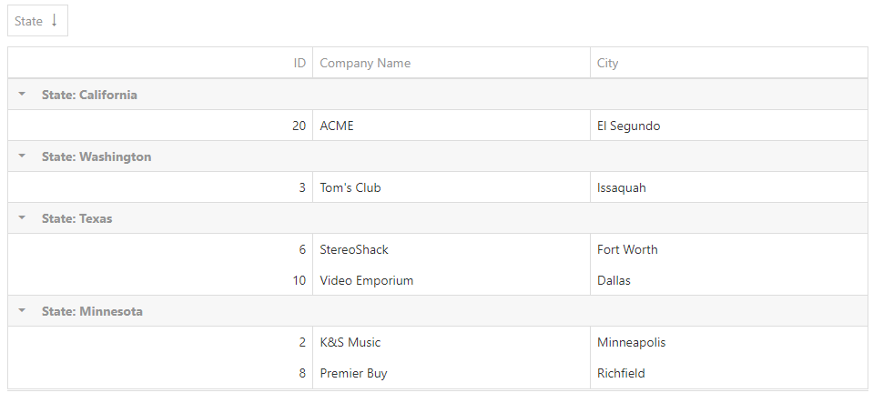

<!-- default badges list -->

<!-- default badges end -->
# DataGrid for DevExtreme - How to apply custom sorting to a grouped column

This example demonstrates how to sort a grouped column. In this example, the California group is always displayed at the top of the grid.

You can implement the sorting technique in two following ways:

1. 

This solution is suitable for very simple cases when paging and group summary are not used. Use the [calculateGroupValue](https://js.devexpress.com/Documentation/ApiReference/UI_Widgets/dxDataGrid/Configuration/columns/#calculateGroupValue) function to sort groups. This function returns values that are used for sorting and displays them in group headers. Use the [groupCellTemplate](https://js.devexpress.com/Documentation/ApiReference/UI_Widgets/dxDataGrid/Configuration/columns/#groupCellTemplate) property to revert the group header text to its initial value. Note that the [remoteOperations](https://js.devexpress.com/Documentation/ApiReference/UI_Widgets/dxDataGrid/Configuration/remoteOperations/) property should be set to **false**.

2. 

The second solution is more universal. It correctly displays summaries and group row texts. It is possible to use remote operations (except the group paging) if a dedicated field is used on the server to sort groups. Use a calculated hidden column to create required cell values to sort them by Summary Group Info.

## Files to Look At

- **jQuery**
    - [index.html](jQuery/index.html)
- **Angular**
    - [app.component.html](Angular/src/app/app.component.html)
    - [app.component.ts](Angular/src/app/app.component.ts)
- **Vue**
    - [App.vue](Vue/src/App.vue)
- **React**
    - [App.js](React/src/App.js)
- **NetCore**    
    - [Index.cshtml](ASP.NET Core/DataGridCustomSorting/Views/Home/Index.cshtml)

## Documentation

- [Getting Started with DataGrid](https://js.devexpress.com/Documentation/Guide/UI_Components/DataGrid/Getting_Started_with_DataGrid/)

- [DataGrid - API Reference](https://js.devexpress.com/Documentation/ApiReference/UI_Components/dxDataGrid/)

## More Examples

- [DataGrid for DevExtreme - How to disable selecting certain rows](https://github.com/DevExpress-Examples/devextreme-datagrid-disable-selecting-certain-rows)

- [TreeList/DataGrid - How to implement a custom column chooser using a Popup with List](https://github.com/DevExpress-Examples/TreeList-DataGrid---Custom-column-chooser)